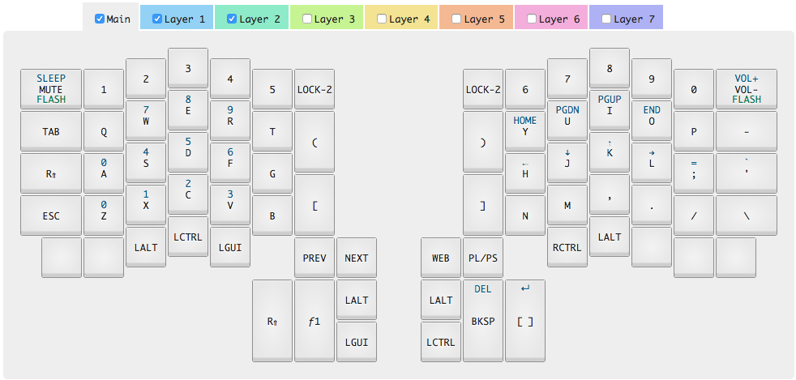

# My Ergodox Configuration

This is the latest version of my ergodox layout. The easiest way to modify it is
with the `import map` button in
[the configurator](https://input.club/configurator-ergodox/).

### Build instructions

Cribbed from [here](https://input.club/configurator-setup/#stepmac)

###### First time setup

 - `brew install dfu-util`

###### Flash - side

 - Plug the correct side directly into computer (don't daisy-chain)
 - Go into flash mode (Default: Top-left key on right keyboard, then top-left key on left keyboard).
 - If left:  `dfu-util -D left_kiibohd.dfu.bin`
 - If right: `dfu-util -D right_kiibohd.dfu.bin`

### If you mess up your keyboard

The Infinity has a reset button on the right half, keep a paper-clip handy.

If you're trying a new layout, flash both halves with the old layout, that way
if you mess up one side, you can still have the other side as a backup working version.

### Layout

